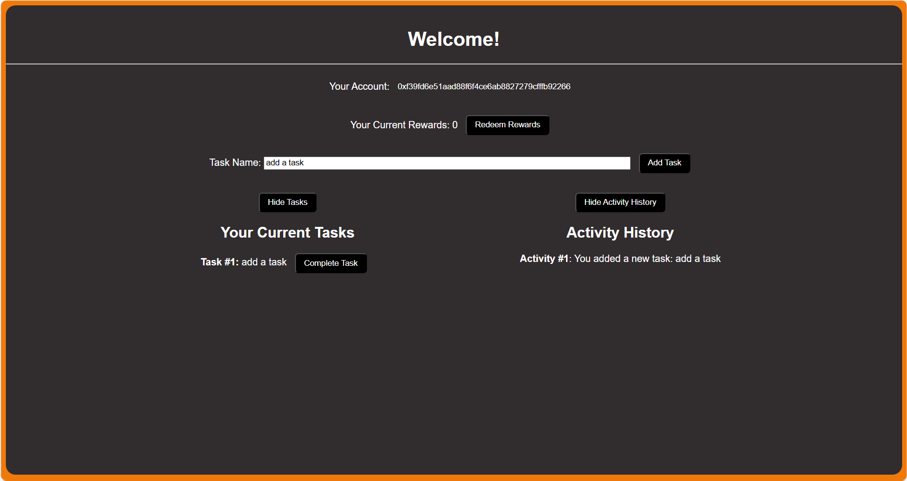

# MC_ETHAVAX-M2_Project

The project is a simple smart contract management for task management and reward redemption.

## Description

This is in fulfillment of the second module of the ETH + AVAX Intermediate course in Metacrafters. The provided starter project from Metacrafters included connecting to MetaMask, depositing, and withdrawing. The code was then modified and a few things were added to the project, such as adding new tasks, completing tasks, redeeming rewards, the structure for the tasks and activities, and the actual activity history and uncompleted tasks list. The frontend was also updated to accommodate the changes that were made.

## Getting Started

### Setting Up

1. To start, you may use the coding editor and environment of your choosing.  

2. In your editor, clone this repository.

3. In your editor, open three terminals.  
  3.1. In the ***first terminal***, put `npm install` or the shorthand `npm i`. Wait for all installations to finish before moving to the next step.  
  3.2. Put `npx hardhat node` in the ***second terminal***. Wait a bit for the accounts to show before moving to the next step.  
  3.3. Put `npx hardhat run --network localhost scripts/deploy.js` in the ***third terminal***. Wait for the contract to be deployed before moving to the next step.  
  3.4. Go back to the ***first terminal*** and put `npm run dev`.  
4. If the frontend didn't automatically open in your browser, look for what address it is running in and open it manually. If you're using localhost, it may be found on [http://localhost:3000/](http://localhost:3000/). If Gitpod, then check your **PORTS** and copy the address from there onto a new tab in your browser.

### How to Use

1. When the frontend launches in your tab, it should look like ***Figure  [1](public/fig1.png)*** if you already have MetaMask. If you haven't setup MetaMask yet, now is the time to do so as it is crucial for the next parts. The network would depend on whether you're using localhost or Gitpod. If Gitpod, check your **PORTS** again and copy the address from there. If localhost, then it may be found on [http://127.0.0.1:8545/](http://127.0.0.1:8545/).  
2. Once you've connected to MetaMask, your page should look like ***Figure 2***. In here, you may do a few things.  
  2.1. **ADD TASK** - In here, you may add a new task. The default task name is `New Task`, however you can change it using the input next to the `Task Name:` label.  
  2.2. **COMPLETE TASK** - In here, you may complete a certain task. You may only complete a task if the uncompleted tasks list is being shown. To show or hide these tasks, refer to 2.4. To complete the task, just click on this button next to the task with that name.  
  2.3. **REDEEM REWARDS** - In here, you may redeem your current rewards. Currently, it is set to 3 completed rewards results in 1 ETH added to your balance which you can then redeem using this button.  
  2.4. **SHOW AND HIDE UNCOMPLETED TASKS**  - In here, you may show or hide all your currently uncompleted tasks. By default, the tasks are shown. If you want to show or hide them, just click on the toggle. If you show it, your page should look like similar to ***Figure [3]***. When your uncompleted tasks are being shown, you also have the option to complete the task by clicking the `Complete Task` button next to it.  
  2.5. **SHOW AND HIDE ACTIVITY HISTORY**  - In here, you may show or hide all your previous activities. By default, your previous activities are hidden. If you want to show or hide them, then just click on this toggle button. If you show activity history, your page should look like similar to ***Figure [3](public/fig3.png)***.  
  2.6. **SHOW AND HIDE USER ADDRESS**  - In here, you may show or hide your user address. By default, it is hidden. If you want to show or hide it, then just click on it. If you have the address hidden, your page should look like similar to ***Figures [2](public/fig2.png)***  or [3](public/fig3.png). If it's showing, it should look similar to ***Figure [4](public/fig4.png)***.  

  
*Figure 1: Not connected to MetaMask yet*  

  
*Figure 2: Connected to MetaMask (Tasks Shown, Activity History Hidden)*  

*Figure 3: Activity History Shown*

*Figure 4: User Address Shown*

## Help

If you run into any problems, you might want to check out the following links:

[Solidity Documentation](https://docs.soliditylang.org/en/v0.8.9/)  
[Next.js Documentation](https://nextjs.org/docs)  
[Hardhat Documentation](https://hardhat.org/docs)  
[MetaMask Documentation](https://docs.metamask.io/wallet/)  

[Common Problems](https://www.youtube.com/watch?v=e_4-Q77XJkw)

## Authors

- airu411
- Starter Project code from [@MetacrafterChris](https://github.com/MetacrafterChris/SCM-Starter)
