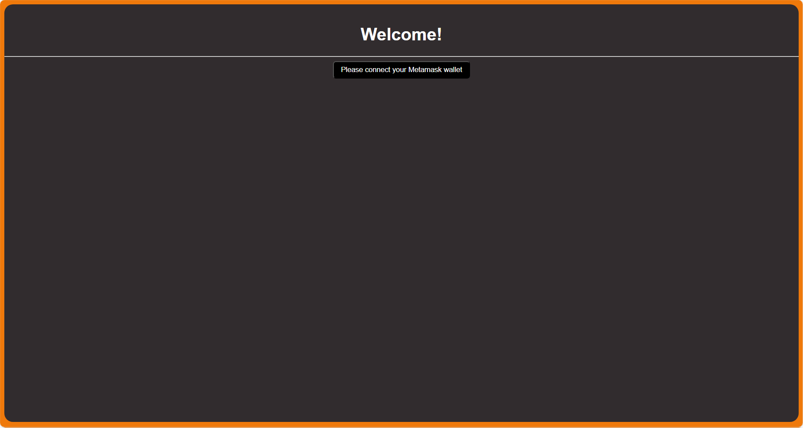
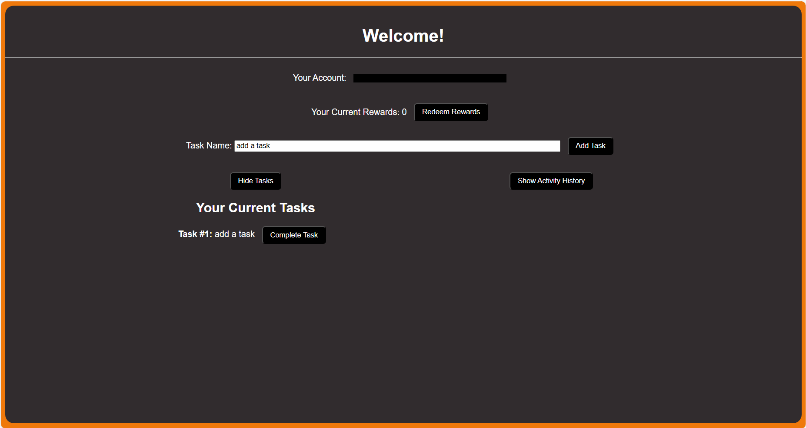

# MC_ETHAVAX-M2_Project

The project is a simple smart contract management for withdrawing, depositing, and transferring.

## Description

This is in fulfillment of the second module of the ETH + AVAX Intermediate course in Metacrafters. The provided starter project from Metacrafters included connecting to MetaMask, depositing to the ATM, and withdrawing from the ATM among others. A few things were then added to the project, such as transferring the token, the structure for the transactions, and the actual transaction history. The deposit and withdraw functions that were provided were modified so that they would be shown in the transaction history. The frontend was also updated to accommodate the changes that were made.

## Getting Started

### Setting Up

1. To start, you may use the coding editor and environment of your choosing.  

2. In your editor, clone this repository.

3. In your editor, open three terminals.  
  3.1. In the ***first terminal***, put `npm install` or the shorthand `npm i`. Wait for all installations to finish before moving to the next step.  
  3.2. Put `npx hardhat node` in the ***second terminal***. Wait a bit for the accounts to show before moving to the next step.  
  3.3. Put `npx hardhat run --network localhost scripts/deploy.js` in the ***third terminal***. Wait for the contract to be deployed before moving to the next step.  
  3.4. Go back to the ***first terminal*** and put `npm run dev`.  
4. If the frontend didn't automatically open in your browser, look for what address it is running in and open it manually. If you're using localhost, it may be found on [http://localhost:3000/](http://localhost:3000/). If Gitpod, then check your **PORTS** and copy the address from there onto a new tab in your browser.

### How to Use

1. When the frontend launches in your tab, it should look like ***Figure 1*** if you already have MetaMask. If you haven't setup MetaMask yet, now is the time to do so as it is crucial for the next parts. The network would depend on whether you're using localhost or Gitpod. If Gitpod, check your **PORTS** again and copy the address from there. If localhost, then it may be found on [http://127.0.0.1:8545/](http://127.0.0.1:8545/).  
2. Once you've connected to MetaMask, your page should look like ***Figure 2***. In here, you may do a few things.  
  2.1. **DEPOSIT ETH** - In here, you may deposit to the ATM. The default amount is 1 ETH, however you can change it using the input next to the `Amount:` label.  
  2.2. **WITHDRAW ETH** - In here, you may withdraw to the ATM. The default amount is 1 ETH, however you can change it using the input next to the `Amount:` label. Make sure that you won't withdraw an amount that is more than your balance.  
  2.3. **TRANSFER ETH** - In here, you may transfer to another account's balance. The default amount is 1 ETH, however you can change it using the input next to the `Amount:` label. You can also set the address to transfer to using the input next to the `Send to:` label. Make sure that you won't transfer an amount that is more than your balance.  
  2.4. **SHOW AND HIDE TRANSACTION HISTORY**  - In here, you may show or hide all your previous transactions. By default, your previous transactions are hidden. If you want to show or hide them, then just click on this toggle button. If you show transaction history, your page should look like similar to ***Figure 3***. If not, it should look like ***Figure 2***. When your transaction history is showing, you also have the option to show or hide the address of those you transferred to by toggling it.  

  
*Figure 1: Not connected to MetaMask yet*  

  
*Figure 2: Connected to MetaMask (Transaction History Hidden)*  

  
*Figure 3: Connected to MetaMask (Transaction History Shown)*  

## Help

If you run into any problems, you might want to check out the following links:

[Solidity Documentation](https://docs.soliditylang.org/en/v0.8.9/)  
[Next.js Documentation](https://nextjs.org/docs)  
[Hardhat Documentation](https://hardhat.org/docs)  
[MetaMask Documentation](https://docs.metamask.io/wallet/)  

[Common Problems](https://www.youtube.com/watch?v=e_4-Q77XJkw)

## Authors

- airu411
- Starter Project code from [@MetacrafterChris](https://github.com/MetacrafterChris/SCM-Starter)
